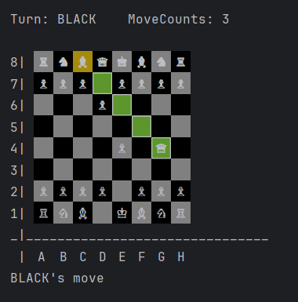
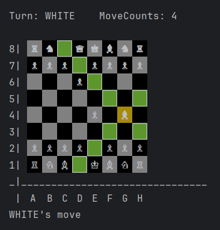

# Simple Test for Chess Homework
To start the game compile and run the [Main.java](./am/aua/chess/Main.java) file. (For better experience use **Intellij IDEA** as it supports unicode characters which can not be rendered in other terminals)
# JDK Version: 21.1.0
# Demo Images

# References
- Information about chess: [https://en.wikipedia.org/wiki/Chess](https://en.wikipedia.org/wiki/Chess)
- Colorful prints [https://www.lihaoyi.com/post/BuildyourownCommandLinewithANSIescapecodes.html](https://www.lihaoyi.com/post/BuildyourownCommandLinewithANSIescapecodes.html)
- Chess Piece Symbols: [https://en.wikipedia.org/wiki/Chess_symbols_in_Unicode](https://en.wikipedia.org/wiki/Chess_symbols_in_Unicode)

## Source
[]

